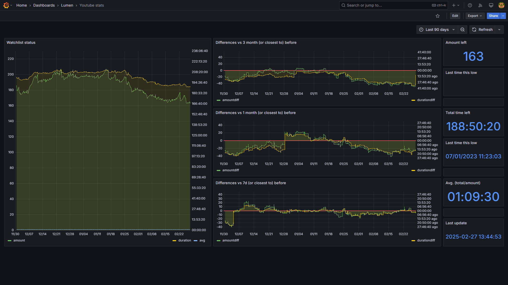

# LUMEN Youtube Module

This module will tell you how many videos and time is left in a specific playlist and store its history in a database table.

*Note:* It has to be a public or unlisted playlist, or a private playlist belonging to the current account. We can't monitore standard youtube watch list because it was removed from Youtube API.

